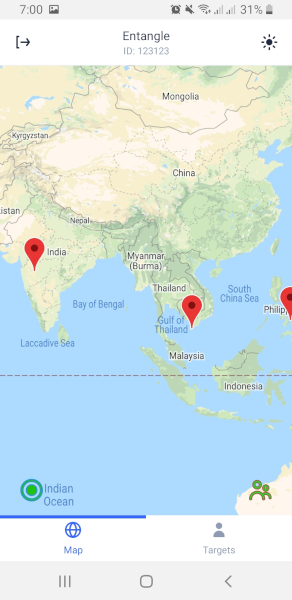
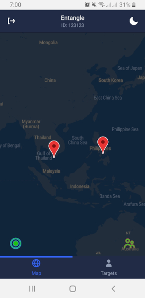

## Entangle

Track anyone, anywhere!.

- Backend server using golang and echo

- Mobile Frameworks using React Native and Expo

- Using [UI Kitten](https://akveo.github.io/react-native-ui-kitten/) for themes

- Database is MongoDB

|          Light          |          Dark          |
| :---------------------: | :--------------------: |
|  |  |

---

### Setup [WIP]

A. Run the backend on `/operations` with `docker-compose up`.
