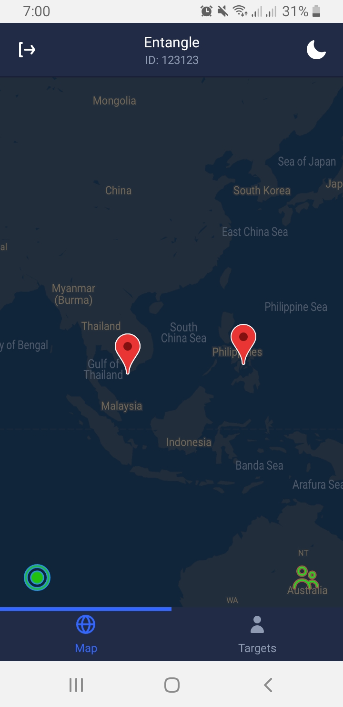

## TrackingTarget

Track someone anywhere

- Backend server using golang and echo

- Mobile using React Native and Expo

- Database is MongoDB

A.  Run the backend on `/operations`: `docker-compose up`

B. Dark and Light themes:

